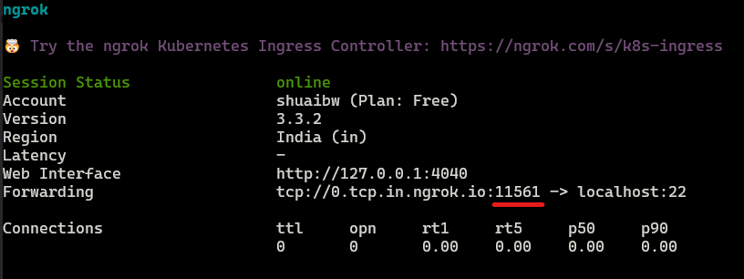

# SSH Setup Guidelines
Ensure you have `openssh-client` installed:
- `sudo apt update`
- `sudo apt install openssh-client`

Copy the secret key to `~/.ssh`. Create the directory if it doesn't exist.
- `mkdir -p ~/.ssh`
- `cp /path/to/secret_key ~/.ssh/secret_key`
- `chmod 600 ~/.ssh/secret_key` (Without this you may get bad permission error)

Connect to the gaming lab machine:
- `ssh -i ~/.ssh/secret_key -CX hp@0.tcp.in.ngrok.io -p PORT_NUM`

Currently, the port number is 11905. If the connection is successful, you will be asked to provide the user passoword, which I have shared in the messenger group. After connecting, you should be able to run anything from the terminal. You can even connect to the machine using VSCode Remote SSH. Please install the [Remote SSH](https://marketplace.visualstudio.com/items?itemName=ms-vscode-remote.remote-ssh) extension and follow the instructions below:
- Press `F1` or `Ctrl+Shift+P` and type `Remote-SSH: Connect to Host`
- Select `Configure SSH Hosts`
- Add the following entry to the `config` file, be sure to replace `PORT_NUM` with the port number you used above:
```
Host gaming-lab-machine
	HostName 0.tcp.in.ngrok.io
	User hp
	IdentityFile ~/.ssh/secret_key
	Port PORT_NUM
	Compression yes
```
If you are connecting from WSL, please make sure that the `config` file is in `~/.ssh/config` and not in `C:\Users\<username>\.ssh\config`.

Save the file and press `F1` or `Ctrl+Shift+P` and type `Remote-SSH: Connect to Host`, then select `gaming-lab-machine`. You will be asked to provide the user password as before. After that, you can open any folder in VSCode and browse the files from there.

 In case you are not able to connect, you have to access the machine using AnyDesk/TeamViewer first and run the following commands from the terminal:
- `sudo service ssh start`
- `ngrok tcp 22`

After that, you will have a window with the following information:



Take a note of the underlined number, replace this with the `PORT_NUM` in the above commands and try connecting again.
